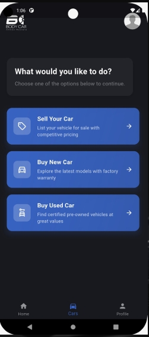

 HEAD
# 🚗 Cars Mobile Application

A cross-platform mobile app built using **Flutter** and **Firebase**, designed to facilitate browsing, buying, and selling cars. This app provides a seamless user experience for general users and includes a dedicated admin dashboard for inventory and request management.

---

## 📱 Features

### 👤 User Side
- Browse **new** and **used** cars by category or filter
- Submit a **Sell Your Car** request with car details and images
- Real-time updates of available cars using Firebase
- Modern, intuitive UI for mobile users

### 🛠 Admin Dashboard
- View, approve, or reject car listings submitted by users
- Manage inventory (add, update, delete cars)
- Handle pending sale requests with status control
- Firebase integration for dynamic sync and database management

---

## 🔧 Tech Stack

- **Frontend**: Flutter, Dart
- **Backend**: Firebase Firestore, Firebase Authentication, Firebase Storage
- **Architecture**: MVC Pattern, Modular Screens, State Management

---

## 🔐 Roles & Access
- **General Users**: Can view cars and submit sell requests
- **Admins**: Full access to car inventory and listing moderation

---

## 📸 Screenshots

  
  
  

  
  
  

=======
# course_project

A new Flutter project.

## Getting Started

This project is a starting point for a Flutter application.

A few resources to get you started if this is your first Flutter project:

- [Lab: Write your first Flutter app](https://docs.flutter.dev/get-started/codelab)
- [Cookbook: Useful Flutter samples](https://docs.flutter.dev/cookbook)

For help getting started with Flutter development, view the
[online documentation](https://docs.flutter.dev/), which offers tutorials,
samples, guidance on mobile development, and a full API reference.
 38546d2 (Update project with latest changes)
